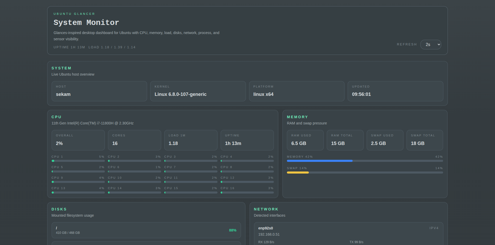

# System Glancer

System Glancer is an Electron desktop app inspired by Glances. It shows live CPU, memory, disk, network, process, and temperature metrics for Ubuntu machines.

## Stack

- Electron 41
- React 19 + TypeScript 6
- Vite 8
- Tailwind CSS 4
- Vitest + React Testing Library
- electron-store

## Scripts

- `npm run dev` — start the app in development mode
- `npm run build` — typecheck, build, package AppImage and deb
- `npm run build:dir` — build unpacked Linux app
- `npm run test` — run tests once

## Features

- Live CPU, memory, swap, and load averages
- Disk usage overview for root and home mounts
- Network interface summary
- Top processes by CPU usage
- Sensor temperature readings via sysfs (`/sys/class/hwmon/`)
- Custom application menu with File, Edit, View, Window, Help (GitHub link + About panel)
- Stored refresh interval preference via electron-store

## Notes

- The app is optimized for Ubuntu and gracefully degrades when optional tools like `sensors` are not installed.
- Process and disk metrics are collected in the main process and exposed via IPC.

## License

Licensed under Apache-2.0.

- You may use, modify, and redistribute the project.
- You must preserve the original copyright notice, license text, and NOTICE attribution.
- Reuse without keeping the original attribution and license terms is not permitted.
